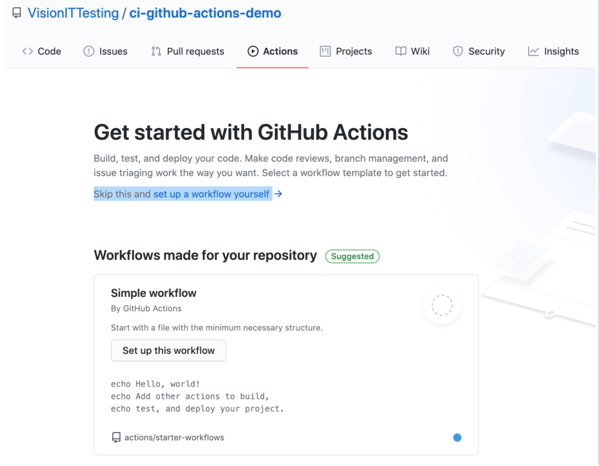
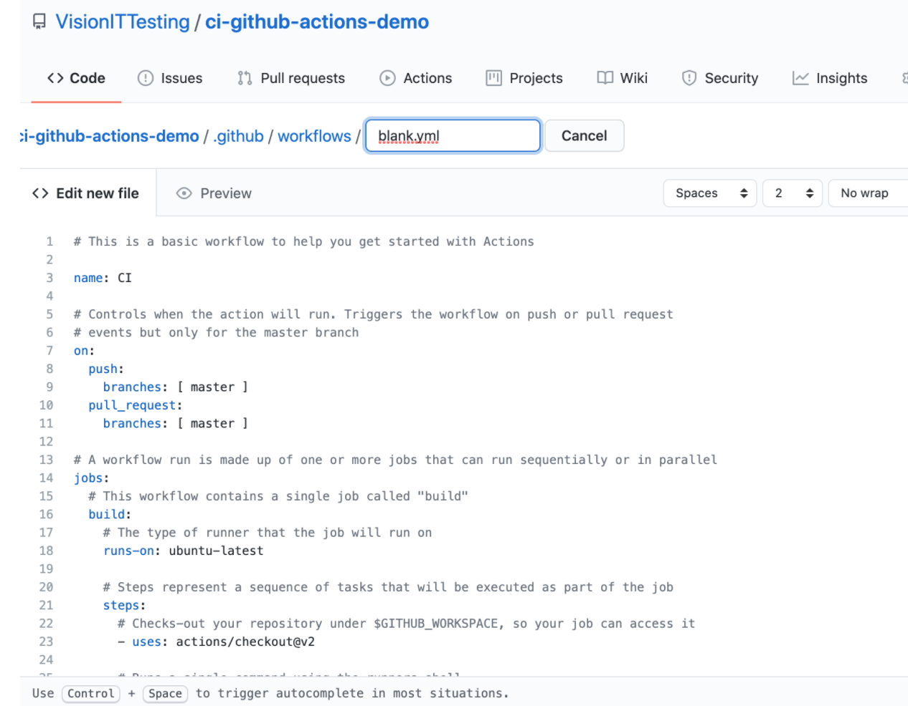
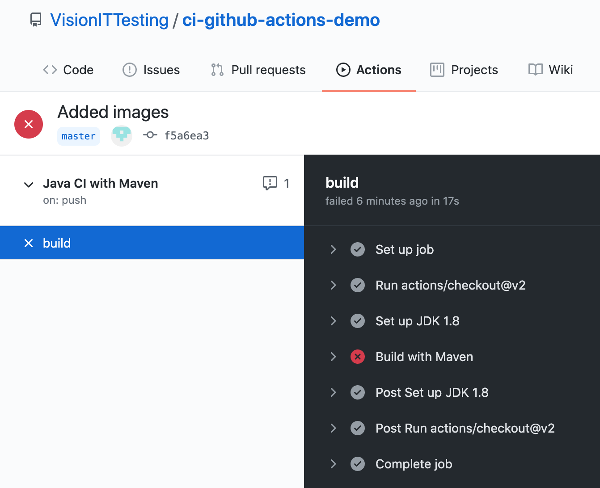
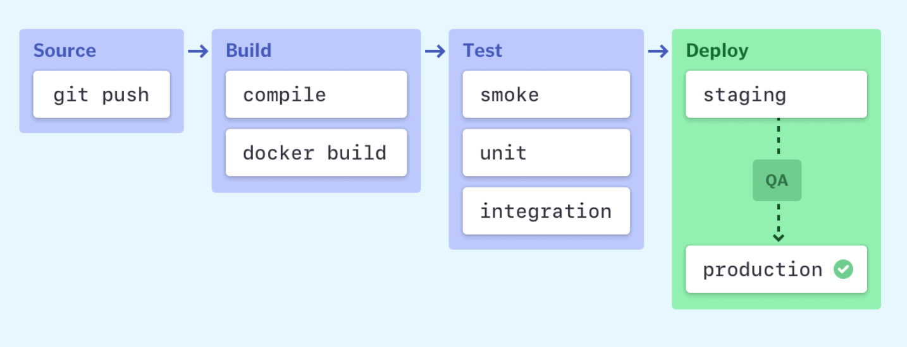
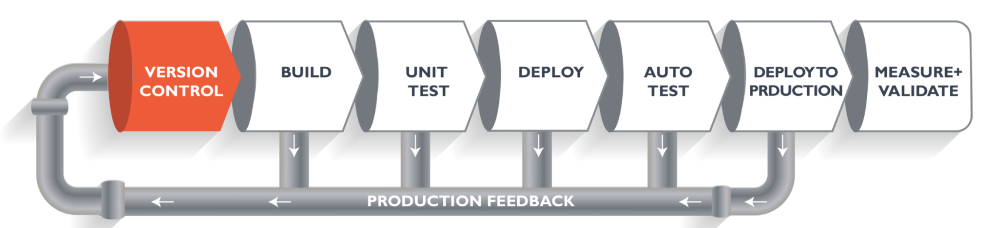
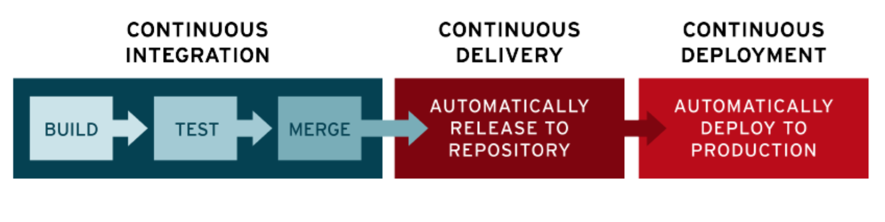

# CI implementation for Test Automation using GitHub Actions

Author
---

This Tutorial is created by Akash Tyagi.
You can reach out to me at: akashdktyagi@gmail.com 

Introduction
---
This demo is about how to use Git Hub Actions to create CI and CD pipeline. 
As a part of this demo we will implement git hub actions to build the maven project and trigger the test cases.

### Steps to Do 

* Create a Java Maven Project
* Add Junit dependency in POM file
* Create a test class and then add add two test cases.

```aidl
public class RunTest {

    @Test
    public void t_01_test_case_is_failed(){
        System.out.println("This test case is supposed to be failed.");
        Assert.assertEquals("Test assertion is failed", true,false);
    }

    @Test
    public void t_02_test_case_is_passed(){
        System.out.println("This test case is supposed to be passed.");
        Assert.assertEquals("Test assertion is passed", true,true);
    }
}
```
* Run the tests using command: ```mvn clean install```
* One test will pass and other will fail. That is how we have created these test cases, so that we can check the same behaviour in the github pipeline.
* Commit the project in a GitHub Repo

* Click on Actions and click on “set up this workflow” link.



* Rename the file as “maven-build.yml” and paste below code in the text editor.



```aidl
# This workflow will build a Java project with Maven
# For more information see: https://help.github.com/actions/language-and-framework-guides/building-and-testing-java-with-maven

name: Java CI with Maven

on:
  push:
    branches: [ master ]
  pull_request:
    branches: [ master ]

jobs:
  build:

    runs-on: ubuntu-latest

    steps:
    - uses: actions/checkout@v2
    - name: Set up JDK 1.8
      uses: actions/setup-java@v1
      with:
        java-version: 1.8
    - name: Build with Maven
      run: mvn clean install

```

* Once the code is commited, pipeline will be sensitive to the 'master' branch push and pr request on the 'master' branch and will automatically triggered.

* To check the result go to Actions tab and click on the latest tab.

* Click on the 'build' link and expand the logs.



---
## CI - CD Introduction

### Stages in CI - CD Pipeline



___



---

